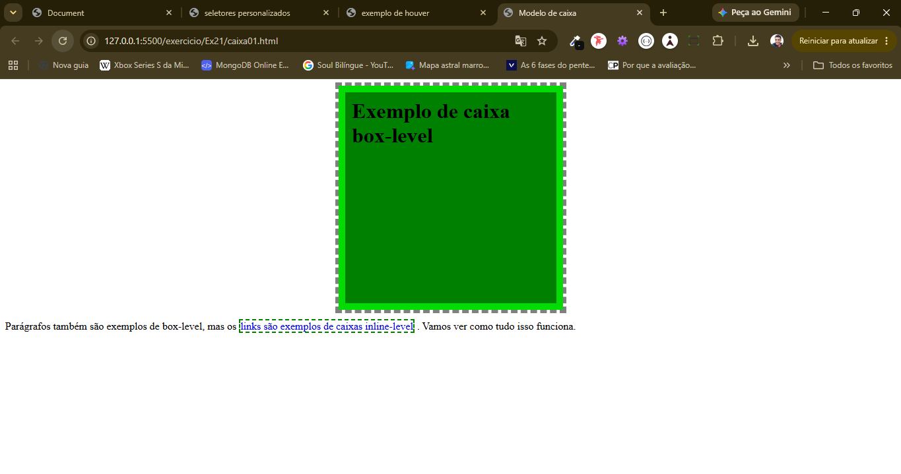
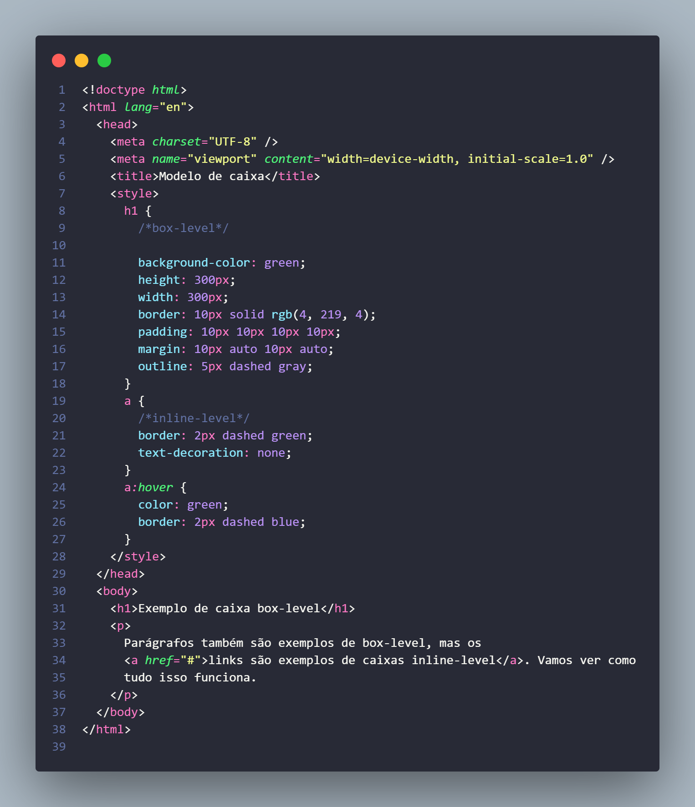

<h2>🖱️ Sobre o Exercício</h2>

<h3>❓ O Que é o Exercício</h3>

Neste exercício, aprendi como funcionam as boxes no HTML5 e como alterá-las e modificá-las com CSS3.

<strong>Site</strong>

<strong>Código</strong>

  <h2>💾 Tecnologias Usadas</h2>
  
  <h3>🌐 Linguagens de Programação e Marcação</h3>

   
  
  

  
  <h3>⌨️ Software e Ferramentas</h3>

  

<h2>🖨️ Como instalar e executar</h2>

Para utilizar este projeto, é necessário usar uma IDE, como o Visual Studio Code, ou o próprio Bloco de Notas. Também é necessário ter um navegador compatível com HTML5 e CSS3 para executar o projeto.

  <h2>👨‍💻 Autor</h2>
  <h3>👍 Quem Sou Eu</h3>
  
Meu nome é Enzo Alves Matos, sou formado em Técnico em Desenvolvimento de Sistemas e, atualmente,
curso Ciência da Computação. Sou apaixonado por desenvolvimento front-end e meu foco atual
é aprimorar minhas habilidades para, no futuro, atuar profissionalmente na criação de sites.

   <h3>📩 Contato  e Agradecimentos</h3>
   
Obrigado pelo seu tempo! Conecte-se comigo:

  
 

